# Architecture Documentation

## System Overview

The OCI Vault MCP Resolver is a secrets management integration layer that sits between Docker MCP Gateway and Oracle Cloud Infrastructure Vault, providing transparent secret resolution with caching and graceful degradation.

## Architecture Diagram

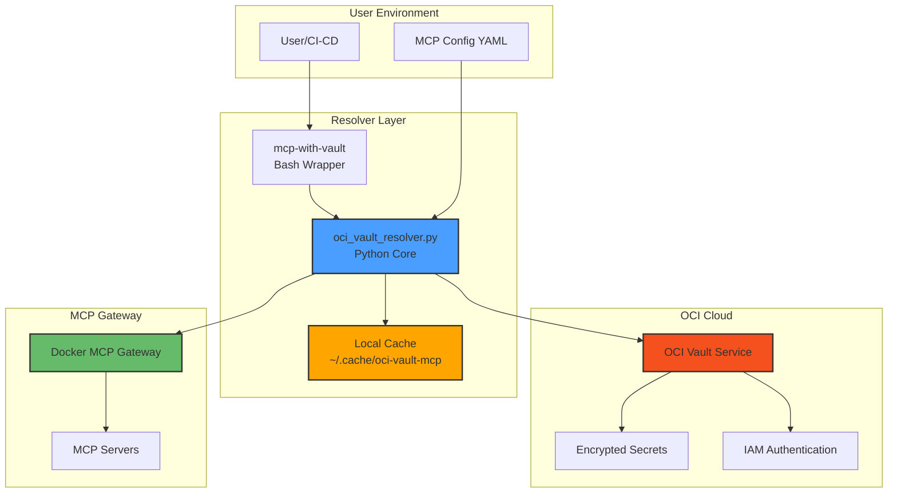

## Component Architecture

### 1. Core Resolver (oci_vault_resolver.py)

**Responsibility**: Secret resolution, caching, and OCI Vault integration

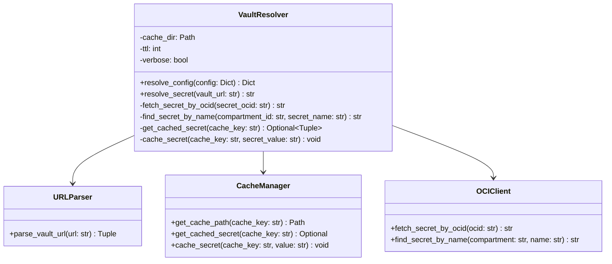

### 2. Wrapper Script (mcp-with-vault)

**Responsibility**: User-friendly CLI interface and workflow orchestration

**Flow**:
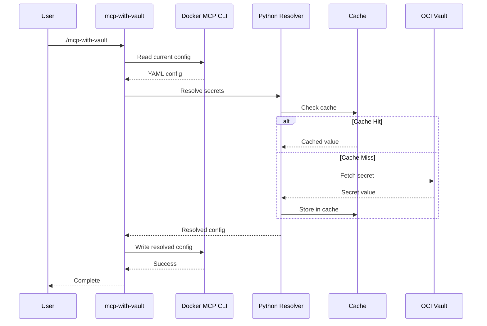

### 3. Cache Layer

**Responsibility**: Performance optimization and availability

**Structure**:
```
~/.cache/oci-vault-mcp/
├── 7a8b9c0d1e2f3g4h.json  # Hashed cache key
│   ├── value: "secret-value"
│   ├── cached_at: 1735480000
│   └── cache_key: "oci-vault://..."
└── ...
```

**Cache Strategy**:
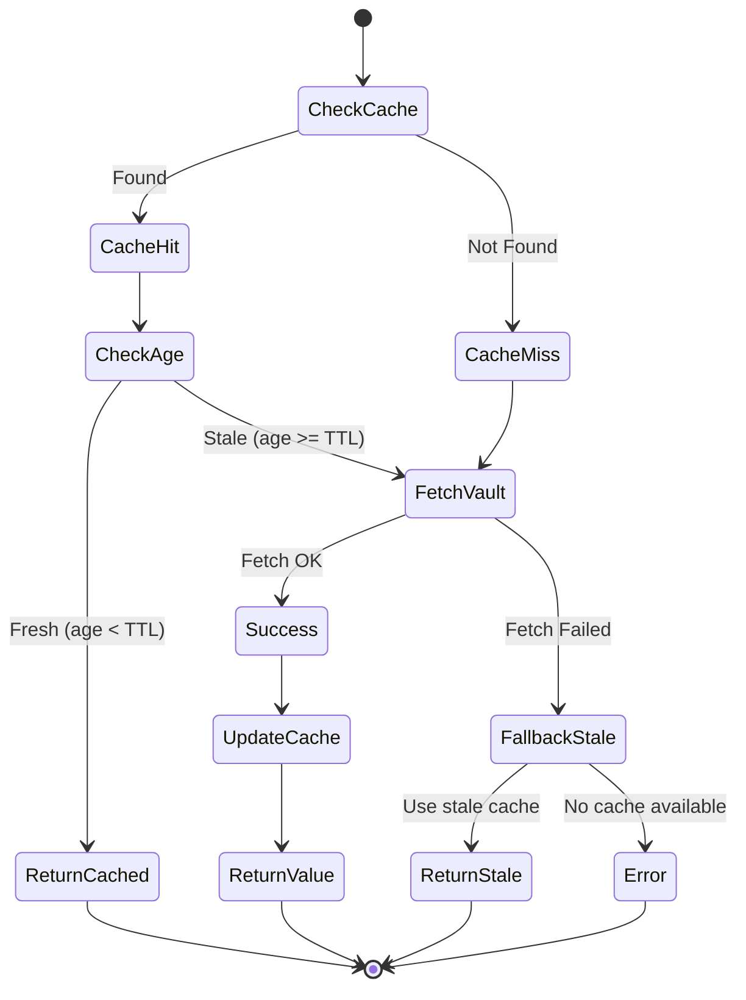

## Data Flow

### Secret Resolution Flow

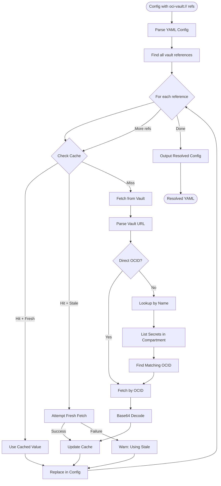

## URL Format Handling

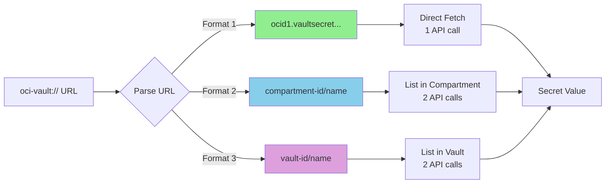

## Security Architecture

### Authentication Flow

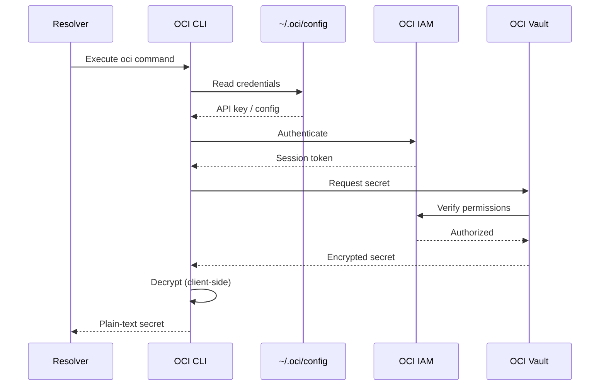

### Security Boundaries

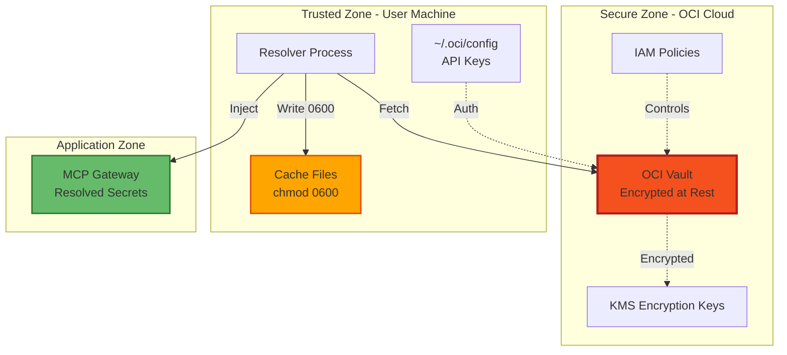

## Performance Characteristics

### Latency Profile

```mermaid
gantt
    title Secret Resolution Latency
    dateFormat X
    axisFormat %L ms

    section Direct OCID (Cache Hit)
    Cache Read: 0, 1

    section Direct OCID (Cache Miss)
    OCI API Call: 0, 500
    Base64 Decode: 500, 510
    Cache Write: 510, 515

    section Compartment+Name (Cache Miss)
    List Secrets API: 0, 400
    Parse Results: 400, 410
    Fetch Secret API: 410, 910
    Base64 Decode: 910, 920
    Cache Write: 920, 925
```

### Scaling Characteristics

| Metric | Cache Hit | Cache Miss (OCID) | Cache Miss (Name) |
|--------|-----------|-------------------|-------------------|
| **Latency** | ~0.1ms | ~500ms | ~900ms |
| **API Calls** | 0 | 1 | 2 |
| **Network I/O** | 0 KB | ~2 KB | ~4 KB |
| **CPU** | Minimal | Minimal | Minimal |
| **Throughput** | 10,000/s | 2/s | 1/s |

## Deployment Patterns

### Pattern 1: Local Development

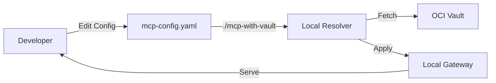

### Pattern 2: CI/CD Pipeline

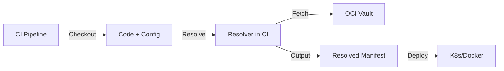

### Pattern 3: Server Startup

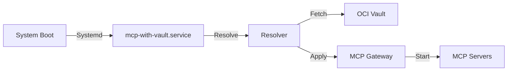

## Error Handling Strategy

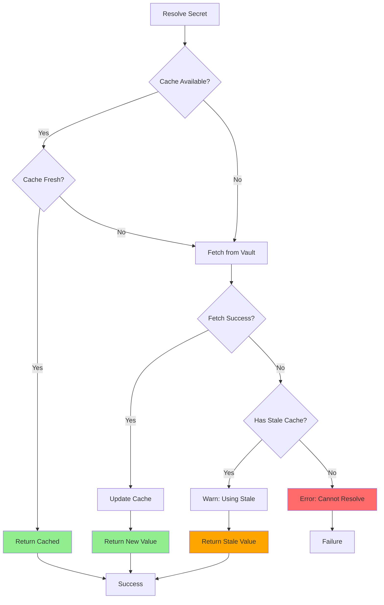

## Integration Points

### Input: MCP Configuration

```yaml
servers:
  service:
    config:
      # Plain values pass through unchanged
      SERVICE_URL: https://api.example.com

      # Vault references are resolved
      API_KEY: oci-vault://compartment-id/secret-name
```

### Output: Resolved Configuration

```yaml
servers:
  service:
    config:
      SERVICE_URL: https://api.example.com
      API_KEY: actual-secret-value  # Resolved from vault
```

### Cache Format

```json
{
  "value": "actual-secret-value",
  "cached_at": 1735480000,
  "cache_key": "oci-vault://compartment-id/secret-name"
}
```

## Operational Characteristics

### Resource Usage

- **Memory**: ~50 MB (Python interpreter + dependencies)
- **Disk**: ~1 KB per cached secret
- **Network**: 1-2 HTTPS requests per cache miss
- **CPU**: Minimal (I/O bound)

### Availability Targets

| Scenario | Behavior | Availability |
|----------|----------|--------------|
| OCI Vault Available + Fresh Cache | Use vault | 99.99% |
| OCI Vault Available + No Cache | Use vault | 99.99% |
| OCI Vault Down + Fresh Cache | Use cache | 100% |
| OCI Vault Down + Stale Cache | Use stale (warn) | 100% |
| OCI Vault Down + No Cache | Fail | 0% |

### Monitoring Points

1. **Cache Hit Rate**: Should be >95% in steady state
2. **API Latency**: Should be <1s for vault calls
3. **Error Rate**: Should be <0.1%
4. **Stale Cache Usage**: Monitor for vault availability issues

## Future Enhancements

### Planned Features

1. **Parallel Resolution**: Resolve multiple secrets concurrently
2. **Secret Versioning**: Support specific secret versions
3. **Auto-Refresh**: Poll for secret updates
4. **Distributed Cache**: Redis/Memcached support
5. **Metrics Export**: Prometheus integration
6. **Secret Rotation Detection**: Automatic cache invalidation

### Extension Points

```python
# Custom cache backend
class RedisCacheBackend(CacheBackend):
    def get(self, key: str) -> Optional[str]:
        return redis_client.get(key)

    def set(self, key: str, value: str, ttl: int):
        redis_client.setex(key, ttl, value)

# Custom secret provider
class AWSSecretsProvider(SecretProvider):
    def fetch_secret(self, secret_id: str) -> str:
        return secrets_manager.get_secret_value(secret_id)
```

## References

- [OCI Vault Documentation](https://docs.oracle.com/en-us/iaas/Content/KeyManagement/home.htm)
- [Docker MCP Gateway](https://docs.docker.com/mcp/)
- [MCP Protocol Specification](https://spec.modelcontextprotocol.io/)
