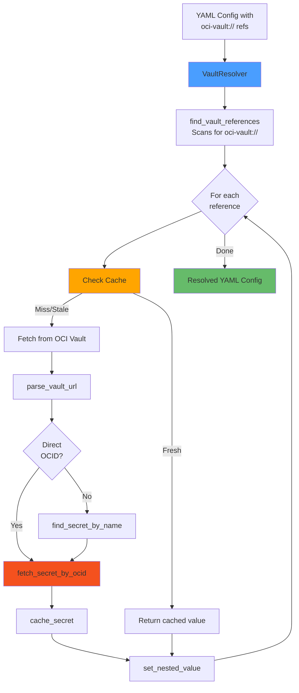
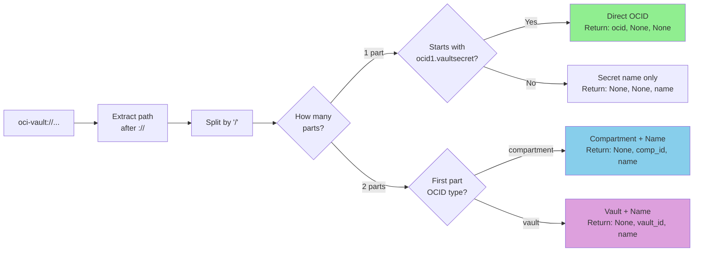
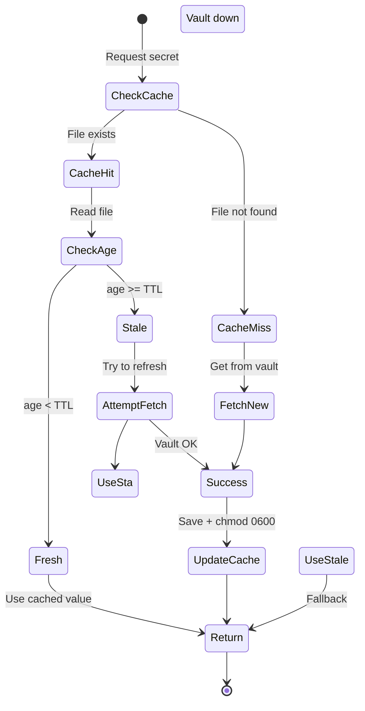
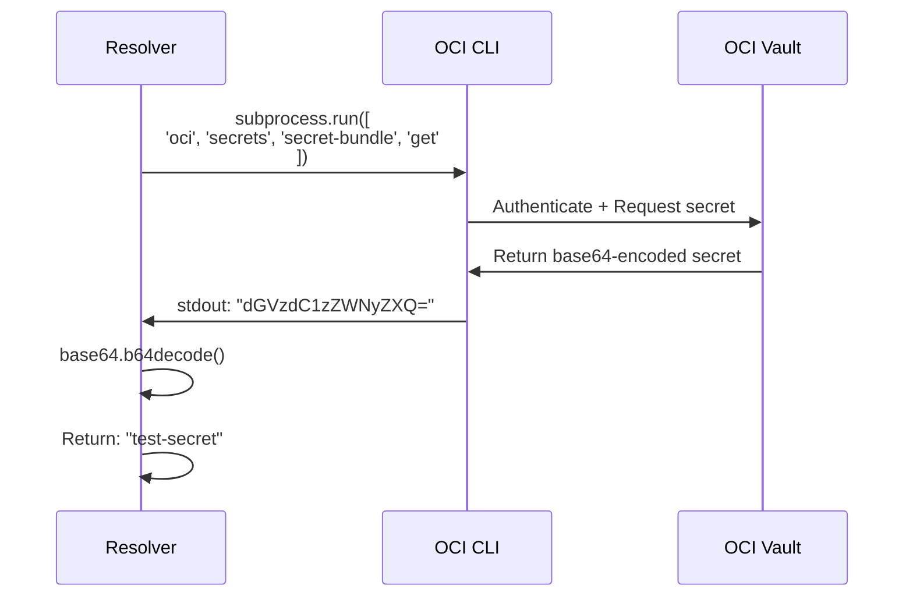
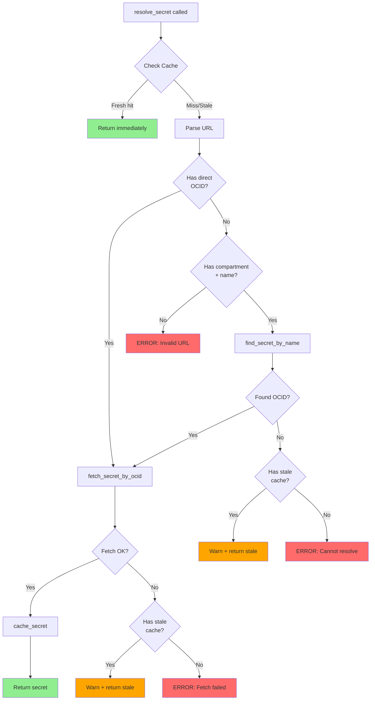
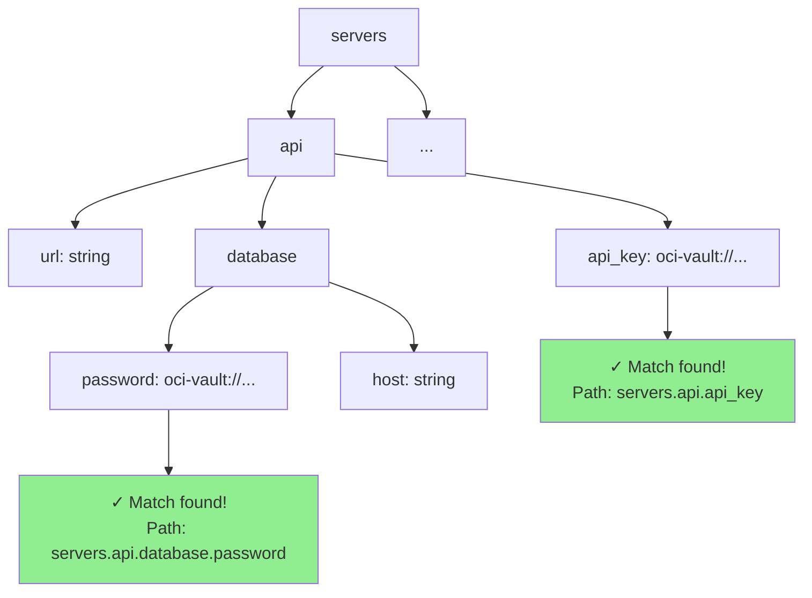
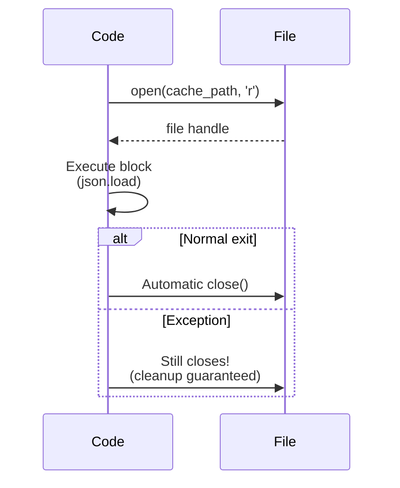
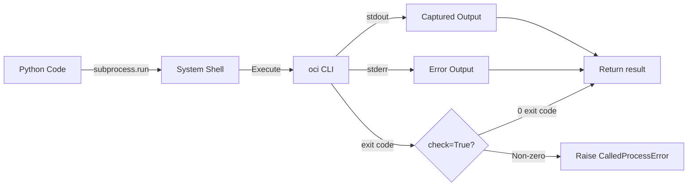

# Code Explained: OCI Vault MCP Resolver

Complete walkthrough of how the OCI Vault MCP Resolver works, from beginner to advanced concepts.

## 📊 Complexity Analysis

**Difficulty Level**: Intermediate
**Lines of Code**: 451
**Key Concepts Used**:
- Object-oriented programming (classes and methods)
- Regular expressions for pattern matching
- File I/O and caching strategies
- Subprocess management for CLI integration
- Recursive data structure traversal
- Error handling with graceful degradation

**Metrics**:
- Functions: 13 methods in VaultResolver class + 1 main function
- Cyclomatic Complexity: Moderate (nested conditionals in parsing and resolution)
- External Dependencies: 3 (yaml, OCI CLI, standard library)

---

## 🎯 What This Code Does (30-Second Summary)

Imagine you have a configuration file with **secret placeholders** like `oci-vault://my-secret-key`. This tool:

1. **Finds** all those placeholders in your YAML config
2. **Fetches** the actual secret values from Oracle Cloud (OCI Vault)
3. **Replaces** the placeholders with real values
4. **Caches** secrets locally for speed (with expiration)
5. **Falls back** to old cached values if the cloud is unreachable

**Real-world analogy**: Think of it like a mail forwarding service. You write "SECRET_KEY" on an envelope, and this tool looks up your actual address (from OCI Vault) and delivers the real content.

---

## 🏗️ High-Level Architecture



---

## 📚 Step-by-Step Code Walkthrough

### Step 1: The VaultResolver Class (Lines 40-48)

```python
class VaultResolver:
    def __init__(self, cache_dir: Path = DEFAULT_CACHE_DIR, ttl: int = DEFAULT_TTL, verbose: bool = False):
        self.cache_dir = cache_dir
        self.ttl = ttl
        self.verbose = verbose
        self.cache_dir.mkdir(parents=True, exist_ok=True)
```

**What it does**: Sets up the resolver with three configuration options

**Breaking it down**:
1. `cache_dir`: Where to store cached secrets (default: `~/.cache/oci-vault-mcp`)
2. `ttl`: Time-to-live - how long cached secrets stay fresh (default: 1 hour)
3. `verbose`: Whether to print debug messages
4. Creates the cache directory if it doesn't exist

**Why this design?**:
- **Flexibility**: Users can customize caching behavior
- **Safety**: `parents=True, exist_ok=True` prevents errors if directory exists
- **Defaults**: Sensible defaults mean zero configuration for most users

---

### Step 2: URL Parsing (Lines 54-87)

This is the **brain** of the URL format handling. Let's break it down:

```python
def parse_vault_url(self, url: str) -> Tuple[Optional[str], Optional[str], Optional[str]]:
    # Returns: (secret_ocid, compartment_id, secret_name)
```

**Visual breakdown of URL parsing**:



**Example transformations**:

```python
# Format 1: Direct OCID
parse_vault_url("oci-vault://ocid1.vaultsecret.oc1.iad.xxx")
# Returns: ("ocid1.vaultsecret.oc1.iad.xxx", None, None)

# Format 2: Compartment + Name
parse_vault_url("oci-vault://ocid1.compartment.oc1..xxx/api-key")
# Returns: (None, "ocid1.compartment.oc1..xxx", "api-key")

# Format 3: Vault + Name
parse_vault_url("oci-vault://ocid1.vault.oc1.iad.xxx/db-password")
# Returns: (None, "ocid1.vault.oc1.iad.xxx", "db-password")
```

**Why three formats?**
- **Format 1 (OCID)**: Fastest, but hard to read/maintain
- **Format 2 (Compartment+Name)**: Portable across environments
- **Format 3 (Vault+Name)**: Scoped to specific vault for multi-vault setups

---

### Step 3: Cache Management (Lines 89-151)

The caching system uses a **three-tier approach**:



**get_cached_secret (Lines 96-130)** - Reading from cache:

```python
def get_cached_secret(self, cache_key: str) -> Optional[Tuple[str, bool]]:
    # Returns: (secret_value, is_stale) or None
```

**Step-by-step**:
1. **Compute cache file path** using SHA256 hash (first 16 chars)
   ```python
   key_hash = hashlib.sha256(cache_key.encode()).hexdigest()[:16]
   # Example: "7a8b9c0d1e2f3g4h"
   ```

2. **Check if file exists** - if not, return None (cache miss)

3. **Load JSON file** with secret and timestamp:
   ```json
   {
     "value": "actual-secret",
     "cached_at": 1735480000,
     "cache_key": "oci-vault://..."
   }
   ```

4. **Calculate age** and determine if stale:
   ```python
   age = time.time() - cached_at
   is_stale = age > self.ttl  # > 3600 seconds?
   ```

5. **Return** `(value, is_stale)` tuple

**cache_secret (Lines 132-151)** - Writing to cache:

```python
def cache_secret(self, cache_key: str, secret_value: str):
```

**Critical security detail** (Line 147):
```python
cache_path.chmod(0o600)  # Only owner can read/write
```

This prevents other users on the system from reading your secrets!

**Permission breakdown**:
```
0o600 = 110 000 000 (binary)
        │││ │││ │││
        │││ │││ └──┴─ Others: no access (000)
        │││ └──┴──┴─ Group: no access (000)
        └──┴──┴────── Owner: read+write (110)
```

---

### Step 4: Fetching Secrets from OCI Vault (Lines 153-217)

This is where we actually talk to Oracle Cloud!

**fetch_secret_by_ocid (Lines 153-186)**:

```python
def fetch_secret_by_ocid(self, secret_ocid: str) -> Optional[str]:
```

**What happens under the hood**:



**Line-by-line breakdown**:

```python
# Lines 158-163: Build OCI CLI command
cmd = [
    'oci', 'secrets', 'secret-bundle', 'get',  # OCI CLI command
    '--secret-id', secret_ocid,                 # Which secret
    '--query', 'data."secret-bundle-content".content',  # Extract only content
    '--raw-output'                              # No JSON wrapping
]

# Lines 165-170: Execute command
result = subprocess.run(
    cmd,
    capture_output=True,  # Capture stdout/stderr
    text=True,            # Decode as text (not bytes)
    check=True            # Raise exception on non-zero exit
)

# Lines 173-177: Decode and return
encoded_content = result.stdout.strip()  # "dGVzdC1zZWNyZXQ="
decoded = base64.b64decode(encoded_content).decode('utf-8')  # "test-secret"
return decoded
```

**Why base64?** OCI Vault stores secrets as base64 because they might contain binary data (encryption keys, certificates, etc.).

**find_secret_by_name (Lines 188-217)** - The name lookup:

This is more complex - it has to:
1. List ALL secrets in a compartment
2. Filter by name using JMESPath query
3. Extract the OCID

```python
# Lines 193-199: The query that does filtering
cmd = [
    'oci', 'vault', 'secret', 'list',
    '--compartment-id', compartment_id,
    '--all',
    '--query', f'data[?"secret-name"==`{secret_name}`].id | [0]',  # JMESPath filter
    '--raw-output'
]
```

**JMESPath query explained**:
```
data[?"secret-name"==`my-secret`].id | [0]
│    │                              │   │
│    │                              │   └─ Take first match
│    │                              └───── Extract 'id' field
│    └────────────────────────────────── Filter where secret-name matches
└─────────────────────────────────────── Start with 'data' array
```

---

### Step 5: The Resolution Process (Lines 219-274)

This is the **orchestrator** that ties everything together:



**Graceful degradation explained** (Lines 251-255, 268-271):

```python
# If we can't fetch fresh, try stale cache
if cached:
    value, _ = cached
    print(f"WARNING: Using stale cached value for {vault_url}", file=sys.stderr)
    return value
```

**Why this matters**: Your application keeps working even if:
- OCI Vault is temporarily down
- Network is unstable
- API quota is exceeded
- Credentials expired

This is **availability over freshness** - a conscious trade-off for production systems.

---

### Step 6: Recursive Config Scanning (Lines 276-298)

This function **walks through** nested YAML structures to find all `oci-vault://` references:

```python
def find_vault_references(self, obj: Any, path: str = "") -> Dict[str, str]:
```

**Visual example of what it does**:

```yaml
# Input YAML:
servers:
  api:
    url: https://api.example.com
    api_key: oci-vault://compartment-id/api-key  # Found!
    database:
      password: oci-vault://ocid1.vaultsecret.xxx  # Found!
      host: postgres.internal  # Not a vault reference, skipped

# Output dictionary:
{
  "servers.api.api_key": "oci-vault://compartment-id/api-key",
  "servers.api.database.password": "oci-vault://ocid1.vaultsecret.xxx"
}
```

**How recursion works**:



**Code breakdown**:

```python
if isinstance(obj, dict):
    # For dictionaries: check each key-value pair
    for key, value in obj.items():
        current_path = f"{path}.{key}" if path else key
        references.update(self.find_vault_references(value, current_path))

elif isinstance(obj, list):
    # For lists: check each item with index
    for idx, item in enumerate(obj):
        current_path = f"{path}[{idx}]"
        references.update(self.find_vault_references(item, current_path))

elif isinstance(obj, str):
    # For strings: check if matches oci-vault:// pattern
    if VAULT_URL_PATTERN.match(obj):
        references[path] = obj
```

**Why track paths?** So we can replace the values later in `set_nested_value`.

---

### Step 7: Nested Value Replacement (Lines 300-325)

This does the **opposite** of `find_vault_references` - it sets values deep in nested structures:

```python
def set_nested_value(self, obj: Any, path: str, value: str) -> Any:
```

**Example transformation**:

```python
# Before:
config = {
    'servers': {
        'api': {
            'api_key': 'oci-vault://...'
        }
    }
}

# Call:
set_nested_value(config, 'servers.api.api_key', 'actual-secret-value')

# After:
config = {
    'servers': {
        'api': {
            'api_key': 'actual-secret-value'  # ← Replaced!
        }
    }
}
```

**How it works**:

```python
# Line 305: Split path into parts
parts = re.split(r'\.|\[|\]', path)  # Split on . [ or ]
parts = [p for p in parts if p]      # Remove empty strings

# Example: "servers.api.database.password"
# Becomes: ['servers', 'api', 'database', 'password']

# Lines 308-317: Navigate to parent
current = obj
for i, part in enumerate(parts[:-1]):  # All but last part
    if part.isdigit():
        current = current[int(part)]   # Array index
    else:
        current = current[part]         # Dict key

# Lines 319-323: Set final value
last_part = parts[-1]
if last_part.isdigit():
    current[int(last_part)] = value    # Array element
else:
    current[last_part] = value          # Dict value
```

---

## 🧠 Advanced Concepts Explained

### Concept 1: Type Hints and Optional

```python
def get_cached_secret(self, cache_key: str) -> Optional[Tuple[str, bool]]:
```

**What does `Optional[Tuple[str, bool]]` mean?**

```python
# This function can return either:
("secret-value", False)   # Tuple[str, bool]
# OR
None                      # Optional allows None

# Think of Optional as: "This value or None"
Optional[str] = str | None
Optional[int] = int | None
```

**Why use type hints?**
- IDE auto-completion works better
- Catch type errors before runtime
- Self-documenting code

### Concept 2: Context Managers (Lines 109, 143)

```python
with open(cache_path, 'r') as f:
    cache_data = json.load(f)
```

**What `with` does**:



**Without `with` (bad)**:
```python
f = open(cache_path, 'r')
cache_data = json.load(f)
f.close()  # If json.load() raises exception, file never closes!
```

**With `with` (good)**:
```python
with open(cache_path, 'r') as f:
    cache_data = json.load(f)
# File ALWAYS closes, even on exception
```

### Concept 3: Subprocess Management (Lines 165-170)

```python
result = subprocess.run(
    cmd,
    capture_output=True,
    text=True,
    check=True
)
```

**What each parameter does**:

| Parameter | Effect | Without it |
|-----------|--------|-----------|
| `capture_output=True` | Captures stdout/stderr | Output goes to terminal |
| `text=True` | Decode as string | Get bytes instead |
| `check=True` | Raise exception on error | Need manual error checking |

**Visual flow**:



### Concept 4: Regular Expressions (Lines 37, 295)

```python
VAULT_URL_PATTERN = re.compile(r'^oci-vault://(.+)$')

if VAULT_URL_PATTERN.match(obj):
    references[path] = obj
```

**Pattern breakdown**:
```
^oci-vault://(.+)$
│           │  │
│           │  └─ End of string
│           └──── Capture group: one or more characters
└────────────────── Start of string
```

**Matching examples**:
```python
VAULT_URL_PATTERN.match("oci-vault://secret-ocid")  # ✓ Match
VAULT_URL_PATTERN.match("oci-vault://")             # ✗ No match (.+ requires at least 1 char)
VAULT_URL_PATTERN.match("vault://secret")           # ✗ No match (wrong prefix)
VAULT_URL_PATTERN.match(" oci-vault://secret")      # ✗ No match (^ requires start)
```

---

## ⚠️ Common Pitfalls and How Code Handles Them

### Pitfall 1: Race Conditions in Caching

**Problem**: What if two processes try to write to cache simultaneously?

**How code handles it** (Line 147):
```python
cache_path.chmod(0o600)  # Atomic operation
```

While not perfect, file writes are atomic on most filesystems, and `chmod` after write minimizes the window. For true multi-process safety, you'd need file locking.

### Pitfall 2: Stale Cache Forever

**Problem**: If OCI Vault is down for days, secrets never refresh!

**How code handles it** (Lines 118-122):
```python
age = time.time() - cached_at
is_stale = age > self.ttl

if is_stale:
    self.log(f"Cache stale: {cache_key} (age: {age:.0f}s)")
# Still tries to fetch fresh, falls back to stale only on error
```

The code **attempts** fresh fetch for stale cache, only falls back if fetch fails.

### Pitfall 3: Secrets in Logs

**Problem**: Debug logs might leak secrets!

**How code handles it**: Notice the code never logs secret **values**, only URLs and metadata:
```python
self.log(f"Successfully fetched: {secret_ocid}")  # ✓ Logs OCID
# NOT: self.log(f"Secret value: {decoded}")       # ✗ Would leak secret
```

### Pitfall 4: Unbounded Cache Growth

**Problem**: Cache directory grows forever!

**How code handles it**: It doesn't! This is a known limitation. Solutions:
1. Periodic cleanup with `rm -rf ~/.cache/oci-vault-mcp/`
2. Add cache eviction (LRU) - future enhancement
3. Use external cache (Redis) with TTL - future enhancement

---

## 🎓 Learning Path

### Beginner Topics to Master

1. **Python Basics**:
   - Classes and methods
   - Type hints
   - Exception handling

2. **File I/O**:
   - Reading/writing files
   - JSON parsing
   - File permissions

3. **Command-line Tools**:
   - `subprocess` module
   - Parsing command output

### Intermediate Topics

1. **Caching Strategies**:
   - TTL-based expiration
   - Cache invalidation patterns
   - Stale-while-revalidate pattern

2. **Recursive Algorithms**:
   - Tree traversal
   - Path tracking
   - Nested structure manipulation

3. **Error Handling**:
   - Graceful degradation
   - Fallback mechanisms
   - Logging vs exceptions

### Advanced Topics

1. **Security**:
   - File permissions (chmod)
   - Secret management best practices
   - Avoiding logs leaking secrets

2. **Performance**:
   - When to cache
   - Parallel vs sequential operations
   - Latency optimization

---

## 🏆 Best Practices Demonstrated

### ✅ Good Patterns in This Code

1. **Clear separation of concerns**:
   - Parsing (lines 54-87)
   - Caching (lines 89-151)
   - Fetching (lines 153-217)
   - Resolution (lines 219-274)

2. **Fail-safe defaults**:
   ```python
   DEFAULT_CACHE_DIR = Path.home() / ".cache" / "oci-vault-mcp"
   DEFAULT_TTL = 3600
   ```

3. **Graceful degradation**:
   - Falls back to stale cache
   - Continues on partial failures
   - Clear error messages

4. **Type safety**:
   - Type hints throughout
   - `Optional` for nullable returns
   - `Tuple` for multiple returns

5. **Security-conscious**:
   - `chmod 0o600` on cache files
   - No secrets in logs
   - Validates input URLs

### ⚠️ Areas for Improvement

1. **No parallel resolution**: Secrets resolved sequentially (lines 344-352)
   ```python
   # Current (slow):
   for path, vault_url in references.items():
       secret_value = self.resolve_secret(vault_url)

   # Better (fast):
   with concurrent.futures.ThreadPoolExecutor() as executor:
       futures = {executor.submit(resolve_secret, url): path
                  for path, url in references.items()}
   ```

2. **No cache eviction**: Old cache files never deleted

3. **No retries**: Single attempt for OCI Vault calls

4. **No metrics**: No way to monitor cache hit rate, latency, etc.

---

## 🎮 Interactive Examples

### Try It Yourself: Caching Behavior

```python
# Example: Test caching logic
from oci_vault_resolver import VaultResolver
import time

resolver = VaultResolver(ttl=5, verbose=True)  # 5 second TTL

# First call - cache miss
resolver.cache_secret("test-key", "secret-value")

# Immediate call - cache hit (fresh)
cached = resolver.get_cached_secret("test-key")
print(f"Fresh cache: {cached}")  # ("secret-value", False)

# Wait 6 seconds
time.sleep(6)

# Now call - cache hit but stale
cached = resolver.get_cached_secret("test-key")
print(f"Stale cache: {cached}")  # ("secret-value", True)
```

### Try It Yourself: URL Parsing

```python
from oci_vault_resolver import VaultResolver

resolver = VaultResolver()

# Test different URL formats
urls = [
    "oci-vault://ocid1.vaultsecret.oc1.iad.xxx",
    "oci-vault://ocid1.compartment.oc1..xxx/api-key",
    "oci-vault://ocid1.vault.oc1.iad.xxx/db-password",
    "invalid-url"
]

for url in urls:
    ocid, comp, name = resolver.parse_vault_url(url)
    print(f"URL: {url}")
    print(f"  OCID: {ocid}")
    print(f"  Compartment: {comp}")
    print(f"  Name: {name}")
    print()
```

---

## 📚 Further Reading

- [Python subprocess documentation](https://docs.python.org/3/library/subprocess.html)
- [OCI Vault documentation](https://docs.oracle.com/en-us/iaas/Content/KeyManagement/home.htm)
- [Caching strategies](https://aws.amazon.com/caching/)
- [Type hints in Python](https://docs.python.org/3/library/typing.html)

---

**Questions?** Open an issue or check [CONTRIBUTING.md](CONTRIBUTING.md) for how to get help!
