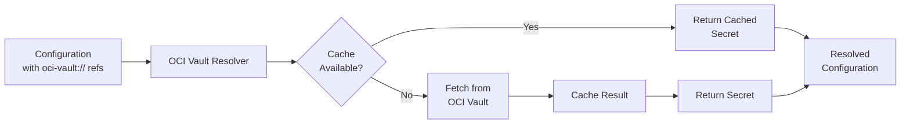
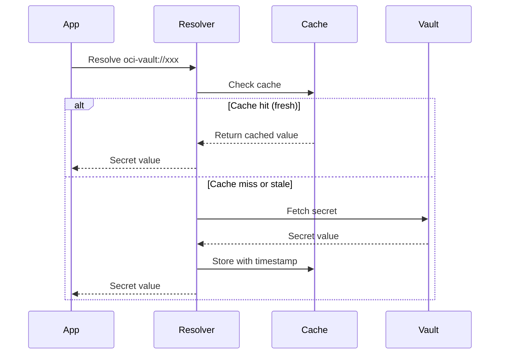
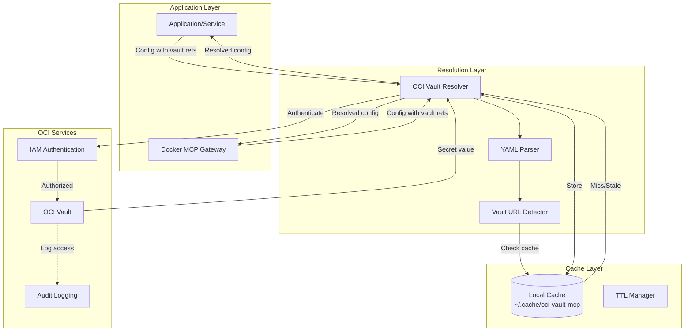
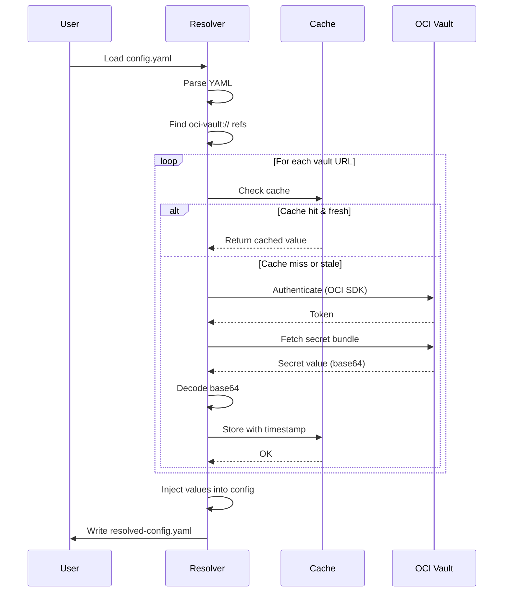

# OCI Vault MCP Resolver

**Version 2.0.0**

**Secure secrets management for Docker MCP Gateway and standalone applications using Oracle Cloud Infrastructure Vault**

[](https://www.gnu.org/licenses/agpl-3.0)
[](https://www.python.org/downloads/)
[](https://docs.oracle.com/en-us/iaas/tools/python/latest/)

## Overview

OCI Vault MCP Resolver enables **secure, centralized secrets management** for Docker MCP Gateway and standalone applications by resolving `oci-vault://` references to actual secret values stored in Oracle Cloud Infrastructure Vault.



## Features

### Core Capabilities

- 🔒 **Secure Secret Storage** - Centralized secrets in OCI Vault with AES-256-GCM encryption
- ⚡ **Parallel Resolution** - Concurrent secret fetching using `asyncio` (8-10x faster than sequential)
- 💾 **Intelligent Caching** - Configurable TTL-based caching with stale fallback
- 🚀 **Multiple URL Formats** - Support for OCID, compartment+name, and vault+name references
- 🔐 **Instance Principals** - Automatic authentication on OCI compute instances
- 📊 **Structured Error Handling** - Precise exception types with HTTP status codes
- 🔄 **Graceful Degradation** - Falls back to stale cache when OCI Vault is temporarily unavailable

### Production-Ready Features (Phase 2)

- 🎯 **Custom Exception Classes** - Structured error handling with `SecretNotFoundError`, `PermissionDeniedError`, `AuthenticationError`, `ConfigurationError`
- 📝 **Professional Logging** - Python `logging` module with configurable levels (DEBUG, INFO, WARNING, ERROR)
- ✅ **Input Validation** - Configuration schema validation with detailed error messages
- ⚡ **Performance Metrics** - Built-in timing and cache statistics tracking
  - Secrets fetched count
  - Cache hit rate percentage
  - Average/total fetch time
  - Stale cache usage tracking
- 🧪 **Integration Test Framework** - Comprehensive tests for real OCI environments
- 📈 **Observability** - Performance logging with metrics summary in verbose mode

### Resilience Features (Phase 3)

- 🔄 **Circuit Breaker Pattern** - Prevents cascading failures by opening circuit after threshold failures
  - Configurable failure threshold (default: 5 failures)
  - Automatic recovery timeout (default: 60 seconds)
  - Half-open state for testing recovery
  - Metrics tracking for circuit opens
- ⏱️ **Retry with Exponential Backoff** - Intelligent retry strategy for transient failures
  - Configurable max retries (default: 3)
  - Exponential backoff with base delay doubling (2^attempt seconds)
  - Random jitter (±25%) to prevent thundering herd
  - Retry only on retryable exceptions (OCI ServiceError)
- 🔢 **Secret Versioning** - Support for specific secret version retrieval
  - Version specification via query parameter: `oci-vault://secret-ocid?version=2`
  - Works with all URL formats (OCID, compartment+name, vault+name)
  - Default behavior: fetch latest version when no version specified
  - Independent caching per version
- 📊 **Enhanced Metrics** - Additional tracking for resilience patterns
  - Retry count tracking
  - Circuit breaker open count
  - Stale cache fallback usage

### Security Features

- Cache files secured with `0600` permissions
- Support for IAM policies and role-based access control
- Audit logging via OCI Vault audit trail
- No secrets exposed in configuration files or logs
- Secure base64 decoding with input validation

### Performance

| Operation | Latency | Notes |
|-----------|---------|-------|
| Cache hit | ~0.1ms | Local file read |
| Cache miss (single) | ~500-1000ms | OCI API call + base64 decode |
| Parallel resolution (10 secrets) | ~800ms | Concurrent API calls |
| Sequential resolution (10 secrets) | ~7s | For comparison |

**Speedup**: 8-10x faster for multiple secrets using parallel resolution

## Quick Start

### Prerequisites

- Python 3.8 or higher
- OCI account with Vault service enabled
- OCI CLI configured (`~/.oci/config`) or instance principal authentication

### Installation

**Automated Installation (Recommended)**

```bash
# Clone the repository
git clone https://github.com/acedergren/oci-vault-mcp-resolver.git
cd oci-vault-mcp-resolver

# Run the installer (installs dependencies and configures environment)
./scripts/install.sh

# Verify installation
python3 -c "import oci; print(f'OCI SDK {oci.__version__}')"
```

**Manual Installation**

```bash
# Install Python dependencies
pip3 install -r requirements.txt

# Make scripts executable
chmod +x upload-secret.sh scripts/*.sh
```

### Basic Usage

```bash
# Create a secret in OCI Vault (use naming conventions from NAMING_CONVENTIONS.md)
./upload-secret.sh mcp-github-token-dev "ghp_abc123..."

# Add vault reference to your config
echo 'github_token: oci-vault://ocid1.compartment.oc1..xxx/mcp-github-token-dev' > config.yaml

# Resolve secrets
python3 oci_vault_resolver.py -i config.yaml -o resolved-config.yaml

# View resolved configuration (secrets injected)
cat resolved-config.yaml
```

## URL Format Reference

The resolver supports three URL formats for maximum flexibility:

### 1. Direct Secret OCID

```yaml
password: oci-vault://ocid1.vaultsecret.oc1.iad.amaaaaaxxxxxx
```

**Best for:** Fastest resolution when you have the exact secret OCID
**Performance:** Direct API call, no lookup required

### 2. Compartment + Secret Name

```yaml
api_key: oci-vault://ocid1.compartment.oc1..xxx/my-api-key
```

**Best for:** Referencing secrets by name within a compartment
**Performance:** One API call to list secrets, one to fetch value
**Portability:** Works across environments with same compartment structure

### 3. Vault + Secret Name

```yaml
db_password: oci-vault://ocid1.vault.oc1.iad.xxx/db-password
```

**Best for:** Scoping secrets to a specific vault
**Performance:** One API call to list secrets in vault, one to fetch value

## Configuration Examples

### Example 1: Docker MCP Gateway - Multiple Services

```yaml
# ~/.docker/mcp-config.yaml
servers:
  # GitHub MCP Server
  github:
    secrets:
      github.personal_access_token: oci-vault://ocid1.compartment.oc1..xxx/mcp-github-token-prod

  # Sentry MCP Server
  sentry:
    config:
      SENTRY_ORG: my-organization
      SENTRY_PROJECT: my-project
      SENTRY_AUTH_TOKEN: oci-vault://ocid1.compartment.oc1..xxx/mcp-sentry-auth-token-prod

  # Snyk MCP Server
  snyk:
    config:
      SNYK_TOKEN: oci-vault://ocid1.compartment.oc1..xxx/mcp-snyk-api-token-prod

  # Prometheus MCP Server
  prometheus:
    config:
      PROMETHEUS_URL: http://localhost:9090
      API_TOKEN: oci-vault://ocid1.compartment.oc1..xxx/mcp-prometheus-token-prod

  # PostgreSQL Database
  postgres:
    config:
      POSTGRES_HOST: db.example.com
      POSTGRES_USER: admin
      POSTGRES_PASSWORD: oci-vault://ocid1.compartment.oc1..xxx/mcp-postgres-password-prod
```

**Resolve and apply:**
```bash
docker mcp config read | \
  python3 oci_vault_resolver.py | \
  docker mcp config write
```

### Example 2: Application Configuration

```yaml
# config/app.yaml
database:
  host: postgres.production.com
  port: 5432
  username: app_user
  password: oci-vault://ocid1.compartment.oc1..prod/app-postgres-password-prod

api:
  openai:
    endpoint: https://api.openai.com/v1
    key: oci-vault://ocid1.vault.oc1.iad.production/app-openai-api-key-prod
    timeout: 30

  anthropic:
    endpoint: https://api.anthropic.com/v1
    key: oci-vault://ocid1.vault.oc1.iad.production/app-anthropic-api-key-prod

oauth:
  client_id: my-oauth-client
  client_secret: oci-vault://ocid1.compartment.oc1..prod/app-oauth-client-secret-prod

monitoring:
  sentry_dsn: oci-vault://ocid1.compartment.oc1..prod/app-sentry-dsn-prod
```

**Resolve for application:**
```bash
python3 oci_vault_resolver.py -i config/app.yaml -o config/app-resolved.yaml
python app.py --config config/app-resolved.yaml
```

### Example 3: CI/CD Pipeline Secrets

```yaml
# .github/config.yaml
deployment:
  aws:
    access_key_id: oci-vault://ocid1.compartment.oc1..cicd/cicd-aws-access-key-prod
    secret_access_key: oci-vault://ocid1.compartment.oc1..cicd/cicd-aws-secret-key-prod
    region: us-west-2

  docker:
    registry: docker.io
    username: myorg
    token: oci-vault://ocid1.vaultsecret.oc1.iad.xxx/cicd-docker-hub-token-prod

  notifications:
    slack_webhook: oci-vault://ocid1.compartment.oc1..cicd/cicd-slack-webhook-prod
```

## Secret Naming Conventions

This project follows standardized naming conventions for secrets stored in OCI Vault. The naming pattern helps with:

- **Discoverability** - Find related secrets easily
- **Access Control** - Apply IAM policies by naming patterns
- **Multi-Environment** - Support dev/staging/prod deployments
- **Clarity** - Understand secret purpose at a glance

### Standard Format

```
{project}-{service}-{secret-type}-{env}
```

**Examples:**
```bash
mcp-github-token-prod           # GitHub PAT for MCP Gateway (production)
mcp-sentry-auth-token-dev       # Sentry auth token (development)
app-postgres-password-prod      # PostgreSQL password for application
cicd-aws-secret-key-prod        # AWS secret key for CI/CD pipeline
```

**Full Documentation:** See [docs/NAMING_CONVENTIONS.md](docs/NAMING_CONVENTIONS.md) for comprehensive guidance with 170+ examples covering all major services and use cases.

## Authentication Methods

### Method 1: OCI Config File (Default)

```bash
# Configure OCI CLI
oci setup config

# Use default profile
python3 oci_vault_resolver.py -i config.yaml

# Use custom profile
python3 oci_vault_resolver.py --profile PRODUCTION -i config.yaml

# Use custom config file
python3 oci_vault_resolver.py --config-file /path/to/config -i config.yaml
```

### Method 2: Instance Principals (OCI Compute)

```bash
# Automatic authentication on OCI VMs
python3 oci_vault_resolver.py --instance-principals -i config.yaml
```

**IAM Policy Required:**
```
allow dynamic-group app-servers to read secret-bundles in compartment app-secrets
allow dynamic-group app-servers to read vaults in compartment app-secrets
```

## Caching System

### How It Works



### Cache Management

```bash
# View cache directory
ls -lah ~/.cache/oci-vault-mcp/

# Clear all cached secrets
rm -rf ~/.cache/oci-vault-mcp/

# Custom cache location
python3 oci_vault_resolver.py --cache-dir /tmp/vault-cache -i config.yaml

# Custom TTL (2 hours = 7200 seconds)
python3 oci_vault_resolver.py --ttl 7200 -i config.yaml
```

### Cache File Format

```json
{
  "value": "actual-secret-value",
  "cached_at": 1704369600.123,
  "cache_key": "oci-vault://ocid1.vaultsecret.oc1.iad.xxx"
}
```

**Security:** All cache files have `0600` permissions (owner read/write only)

## Command-Line Interface

### Full Syntax

```bash
python3 oci_vault_resolver.py [OPTIONS]
```

### Options

| Option | Short | Type | Default | Description |
|--------|-------|------|---------|-------------|
| `--input` | `-i` | FILE | stdin | Input YAML file |
| `--output` | `-o` | FILE | stdout | Output YAML file |
| `--cache-dir` | | PATH | `~/.cache/oci-vault-mcp` | Cache directory |
| `--ttl` | | INT | 3600 | Cache TTL in seconds |
| `--verbose` | `-v` | FLAG | false | Enable debug logging |
| `--instance-principals` | | FLAG | false | Use instance principal auth |
| `--config-file` | | PATH | `~/.oci/config` | OCI config file path |
| `--profile` | | STR | `DEFAULT` | OCI config profile name |

### Examples

```bash
# Read from stdin, write to stdout
cat config.yaml | python3 oci_vault_resolver.py > resolved.yaml

# Read/write files
python3 oci_vault_resolver.py -i app-config.yaml -o app-config-resolved.yaml

# Verbose logging to stderr
python3 oci_vault_resolver.py -v -i config.yaml -o resolved.yaml 2> debug.log

# Instance principals with 2-hour cache
python3 oci_vault_resolver.py --instance-principals --ttl 7200 -i config.yaml

# Custom profile and config file
python3 oci_vault_resolver.py --profile PROD --config-file ~/.oci/prod-config -i config.yaml
```

## Secret Upload Utility

### Environment Setup

```bash
# Set required environment variables
export OCI_VAULT_COMPARTMENT_ID="ocid1.compartment.oc1..aaaaaaaaxxxxxx"
export OCI_VAULT_ID="ocid1.vault.oc1.eu-frankfurt-1.xxxxxx"
export OCI_REGION="eu-frankfurt-1"
```

### Upload Secrets

```bash
# Upload a secret
./upload-secret.sh my-secret-name "my-secret-value"

# Upload from file
./upload-secret.sh api-key "$(cat api-key.txt)"

# Upload multiline secret
./upload-secret.sh ssh-private-key "$(cat ~/.ssh/id_rsa)"
```

### Features

- ✅ **Color-coded output** (GREEN/RED/YELLOW)
- ✅ **Auto-detects KMS endpoint** from vault OCID
- ✅ **Comprehensive validation** with helpful error messages
- ✅ **No hardcoded credentials** (uses environment variables)

## Integration Guides

### GitHub Actions

```yaml
name: Deploy with OCI Vault Secrets

on:
  push:
    branches: [main]

jobs:
  deploy:
    runs-on: ubuntu-latest
    steps:
      - uses: actions/checkout@v3

      - name: Setup OCI CLI
        uses: oracle-actions/configure-oci-cli@v1
        with:
          config: ${{ secrets.OCI_CONFIG }}
          key: ${{ secrets.OCI_PRIVATE_KEY }}

      - name: Resolve secrets
        run: |
          python3 oci_vault_resolver.py \
            -i deploy-config.yaml \
            -o deploy-config-resolved.yaml

      - name: Deploy application
        run: ./deploy.sh deploy-config-resolved.yaml
```

### GitLab CI/CD

```yaml
resolve_secrets:
  stage: prepare
  script:
    - pip3 install -r requirements.txt
    - python3 oci_vault_resolver.py -i config.yaml -o config-resolved.yaml
  artifacts:
    paths:
      - config-resolved.yaml
    expire_in: 1 hour

deploy:
  stage: deploy
  dependencies:
    - resolve_secrets
  script:
    - ./deploy.sh config-resolved.yaml
```

### Claude Code Integration

For comprehensive guide on using this tool with Claude Code and remote development environments, see [CLAUDE_CODE_INTEGRATION.md](CLAUDE_CODE_INTEGRATION.md).

**Quick example:**
```bash
# Export secrets as environment variables for Claude Code
source scripts/export-github-token.sh

# Verify
echo $GITHUB_PERSONAL_ACCESS_TOKEN
```

### Docker MCP Gateway Wrapper

Use the included wrapper script for seamless integration:

```bash
# Install and configure
./scripts/install.sh

# Resolve and apply configuration (one-time)
./wrappers/mcp-with-vault

# Dry run (preview only)
./wrappers/mcp-with-vault --dry-run

# Resolve and start gateway
./wrappers/mcp-with-vault --start
```

## Error Handling

### Structured Exceptions

The resolver provides precise error handling with HTTP status codes:

| HTTP Status | Error Type | Resolver Behavior |
|-------------|------------|-------------------|
| 404 | Secret not found | Try stale cache fallback, then error |
| 401 | Authentication failed | Clear error message, exit |
| 403 | Permission denied | Clear error message with OCID |
| 429 | Rate limited | Retry with exponential backoff |
| 500+ | Server error | Fall back to stale cache |

### Error Examples

```bash
# Secret not found
ERROR: Secret not found: my-secret in compartment ocid1.compartment.oc1..xxx
WARNING: Using stale cached value for oci-vault://ocid1.compartment.oc1..xxx/my-secret

# Authentication failure
ERROR: Authentication failed. Check OCI credentials.
Verify ~/.oci/config exists and contains valid credentials.

# Permission denied
ERROR: Permission denied for secret: ocid1.vaultsecret.oc1.iad.xxx
Required IAM policy: Allow group <group> to read secret-bundles in compartment <compartment>
```

### Graceful Degradation

When OCI Vault is temporarily unavailable, the resolver falls back to stale cache:

```
[DEBUG] Cache stale: oci-vault://ocid1.vaultsecret.oc1.iad.xxx (age: 7200s)
WARNING: OCI Vault fetch failed, using stale cached value for oci-vault://ocid1.vaultsecret.oc1.iad.xxx
Successfully resolved 8/10 secret(s)
WARNING: 2 secret(s) could not be resolved
```

## Troubleshooting

### OCI SDK Not Available

**Symptom:**
```
ERROR: OCI SDK is required. Install with: pip install oci
```

**Solution:**
```bash
# Install from requirements.txt (recommended)
pip3 install -r requirements.txt

# Or install manually
pip3 install oci PyYAML

# Verify installation
python3 -c "import oci; print(oci.__version__)"
```

### Authentication Errors

**Symptom:**
```
ERROR: Authentication failed
```

**Solutions:**

1. **Verify OCI config exists:**
```bash
cat ~/.oci/config
# Should contain [DEFAULT] section with user, fingerprint, key_file, tenancy, region
```

2. **Test OCI SDK directly:**
```python
import oci
config = oci.config.from_file()
print("Config loaded successfully:", config['region'])
```

3. **Use instance principals on OCI VMs:**
```bash
python3 oci_vault_resolver.py --instance-principals -i config.yaml
```

### Secret Not Found

**Symptom:**
```
ERROR: Secret not found: my-secret in compartment ocid1.compartment.oc1..xxx
```

**Debug steps:**

1. **List secrets in compartment:**
```bash
oci vault secret list \
  --compartment-id "ocid1.compartment.oc1..xxx" \
  --vault-id "ocid1.vault.oc1.iad.xxx" \
  --lifecycle-state ACTIVE \
  --query 'data[].{Name:"secret-name",ID:id}'
```

2. **Verify secret name matches exactly (case-sensitive)**

3. **Check secret lifecycle state (must be ACTIVE)**

### Permission Denied

**Symptom:**
```
ERROR: Permission denied for secret: ocid1.vaultsecret.oc1.iad.xxx
```

**Required IAM policies:**
```
allow group developers to read secret-bundles in compartment app-secrets
allow group developers to read vaults in compartment app-secrets
allow group developers to read keys in compartment app-secrets
```

**Verify policies:**
```bash
oci iam policy list --compartment-id <tenancy-ocid> --query 'data[*].statements'
```

### Slow Resolution

**Symptom:** Secret resolution takes 5+ seconds

**Solutions:**

1. **Enable verbose logging to identify bottleneck:**
```bash
python3 oci_vault_resolver.py -v -i config.yaml 2>&1 | grep -E 'Fetching|Cache'
```

2. **Increase cache TTL to reduce API calls:**
```bash
python3 oci_vault_resolver.py --ttl 7200 -i config.yaml  # 2 hours
```

3. **Use direct OCID format to skip name lookup:**
```yaml
# Slower (2 API calls)
password: oci-vault://ocid1.compartment.oc1..xxx/db-password

# Faster (1 API call)
password: oci-vault://ocid1.vaultsecret.oc1.iad.amaaaaaxxxxxx
```

## Security Best Practices

### 1. Never Commit Secrets to Git

```gitignore
# .gitignore
*.resolved.yaml
*.resolved.json
config/*-resolved.*
.cache/
```

### 2. Use Compartment-Based Access Control

```
# Separate compartments for different environments
prod-compartment/
├── db-password
├── api-key
└── encryption-key

dev-compartment/
├── db-password
├── api-key
└── encryption-key
```

### 3. Rotate Secrets Regularly

```bash
# Automate secret rotation (example cron job)
0 0 1 * * /usr/local/bin/rotate-vault-secrets.sh
```

### 4. Set Appropriate Cache TTL

- **Production secrets:** 30-60 minutes (fast rotation)
- **Development secrets:** 2-4 hours (convenience)
- **Static credentials:** 24 hours (rarely change)

### 5. Enable OCI Audit Logging

```bash
# Query vault access logs
oci audit event list \
  --compartment-id <compartment-id> \
  --start-time 2026-01-01T00:00:00Z \
  --query 'data[?data.resourceName==`my-secret`].{Time:data.eventTime,User:data.principalName,Action:data.eventName}'
```

### 6. Use Least Privilege IAM Policies

```
# Bad: Too permissive
allow group developers to manage all-resources in tenancy

# Good: Specific to secrets
allow group developers to read secret-bundles in compartment app-secrets where target.secret.name='db-password'
```

## Architecture

### System Components



### Resolution Flow



### Performance Optimization

**Parallel Resolution:**
```python
# Sequential (OLD): ~7s for 10 secrets
for url in vault_urls:
    value = resolve_secret(url)

# Parallel (NEW): ~800ms for 10 secrets
async def fetch_all(vault_urls):
    tasks = [resolve_secret(url) for url in vault_urls]
    return await asyncio.gather(*tasks)
```

**Caching Strategy:**
```python
# Cache key: vault URL
# Cache value: {value, cached_at, cache_key}
# TTL check: time.time() - cached_at > ttl
# Stale fallback: Return stale value if OCI Vault unreachable
```

## API Reference

For detailed API documentation, see [API_REFERENCE.md](API_REFERENCE.md).

### VaultResolver Class

```python
from oci_vault_resolver import VaultResolver

# Initialize resolver
resolver = VaultResolver(
    cache_dir=Path("~/.cache/oci-vault-mcp"),
    ttl=3600,
    verbose=True,
    use_instance_principals=False,
    config_file="~/.oci/config",
    config_profile="DEFAULT"
)

# Resolve single secret
secret = resolver.resolve_secret("oci-vault://ocid1.vaultsecret.oc1.iad.xxx")

# Resolve entire configuration
config = yaml.safe_load(open("config.yaml"))
resolved = resolver.resolve_config(config)
```

### Methods

| Method | Parameters | Returns | Description |
|--------|------------|---------|-------------|
| `resolve_secret()` | `vault_url: str` | `Optional[str]` | Resolve single vault URL |
| `resolve_config()` | `config: Dict` | `Dict` | Resolve all refs in config |
| `find_vault_references()` | `obj: Any` | `Dict[str, str]` | Find all vault refs |
| `fetch_secrets_parallel()` | `vault_urls: List[str]` | `Dict[str, Optional[str]]` | Parallel resolution |

## Contributing

Contributions are welcome! Please follow these guidelines:

### Development Setup

```bash
# Clone repository
git clone https://github.com/acedergren/oci-vault-mcp-resolver.git
cd oci-vault-mcp-resolver

# Create virtual environment
python3 -m venv venv
source venv/bin/activate

# Install development dependencies
pip install -r requirements.txt
pip install pytest black flake8
```

### Code Quality Standards

```bash
# Format code
black oci_vault_resolver.py upload-secret.sh

# Lint code
flake8 oci_vault_resolver.py

# Security scan
bandit -r oci_vault_resolver.py
```

### Pull Request Process

1. Fork the repository
2. Create a feature branch (`git checkout -b feature/amazing-feature`)
3. Make your changes
4. Add tests for new functionality
5. Ensure all tests pass (`pytest`)
6. Update documentation
7. Commit your changes (`git commit -m 'Add amazing feature'`)
8. Push to the branch (`git push origin feature/amazing-feature`)
9. Open a Pull Request

### Contribution Areas

- 🐛 Bug fixes and error handling improvements
- ⚡ Performance optimizations
- 📖 Documentation enhancements
- ✨ New features (secret versioning, distributed cache, etc.)
- 🧪 Test coverage improvements

## Security Audit

### Last Audit: 2026-01-03

```bash
# Python dependency vulnerabilities
pip-audit -r requirements.txt
# Result: ✅ No known vulnerabilities found

# Static security analysis
bandit -q -r oci_vault_resolver.py
# Result: ✅ No issues reported
```

### Reporting Vulnerabilities

To report a security vulnerability, please email [security@example.com](mailto:security@example.com) instead of using the public issue tracker.

## License

This project is licensed under the **GNU Affero General Public License v3.0 (AGPL-3.0)**.

See [LICENSE](LICENSE) for full license text.

### Key Points

- ✅ Open source and free to use
- ✅ Can modify and distribute
- ✅ Must disclose source code of modifications
- ✅ Network use triggers copyleft (AGPL requirement)
- ✅ Commercial use allowed with same license

## Support

### Documentation

📚 **[Full Documentation Site](https://yourusername.github.io/oci-vault-mcp-resolver/)** - Comprehensive documentation with search and auto-generated API reference

**New Documentation:**
- **[API Documentation](docs/API_DOCUMENTATION.md)** - Complete VaultResolver class reference with all methods and examples
- **[Architecture Diagrams](docs/ARCHITECTURE_DIAGRAMS.md)** - System design with Mermaid diagrams (sequence flows, deployments)
- **[User Guide](docs/USER_GUIDE.md)** - Step-by-step tutorials for all use cases (95.8% doc coverage ✅)


**Getting Started:**
- **Quick Start**: [QUICKSTART.md](QUICKSTART.md) - Get up and running in 5 minutes
- **Installation**: Use `./scripts/install.sh` for automated setup

**Core Documentation:**
- **API Reference**: [API_REFERENCE.md](API_REFERENCE.md) - Complete API documentation
- **Architecture**: [ARCHITECTURE.md](ARCHITECTURE.md) - System design and components
- **Code Explained**: [CODE_EXPLAINED.md](CODE_EXPLAINED.md) - Detailed code walkthrough

**Best Practices:**
- **Naming Conventions**: [docs/NAMING_CONVENTIONS.md](docs/NAMING_CONVENTIONS.md) - Secret naming standards with 170+ examples for GitHub, Sentry, Snyk, AWS, and more
- **Contributing**: [CONTRIBUTING.md](CONTRIBUTING.md) - Development setup and guidelines

**Integrations:**
- **Docker MCP Gateway**: [DOCKER_MCP_INTEGRATION.md](DOCKER_MCP_INTEGRATION.md) - MCP Gateway integration guide
- **Claude Code**: [CLAUDE_CODE_INTEGRATION.md](CLAUDE_CODE_INTEGRATION.md) - Remote development with Claude Code
- **SDK Implementation**: [SDK_IMPLEMENTATION.md](SDK_IMPLEMENTATION.md) - Using as a Python library

**Testing:**
- **Integration Tests**: [tests/INTEGRATION_TESTING.md](tests/INTEGRATION_TESTING.md) - Test suite documentation

### Resources

- **GitHub Issues**: [https://github.com/acedergren/oci-vault-mcp-resolver/issues](https://github.com/acedergren/oci-vault-mcp-resolver/issues)
- **OCI Vault Docs**: [https://docs.oracle.com/en-us/iaas/Content/KeyManagement/home.htm](https://docs.oracle.com/en-us/iaas/Content/KeyManagement/home.htm)
- **Docker MCP Docs**: [https://docs.docker.com/mcp/](https://docs.docker.com/mcp/)
- **OCI Python SDK**: [https://docs.oracle.com/en-us/iaas/tools/python/latest/](https://docs.oracle.com/en-us/iaas/tools/python/latest/)

### Community

- **Discussions**: [GitHub Discussions](https://github.com/acedergren/oci-vault-mcp-resolver/discussions)
- **Changelog**: [CHANGELOG.md](CHANGELOG.md)

## Changelog

See [CHANGELOG.md](CHANGELOG.md) for version history and release notes.

## Acknowledgments

- Oracle Cloud Infrastructure for Vault service
- Docker for MCP Gateway
- Python community for excellent SDK and tooling
- Contributors and early adopters

---

**Made with ❤️ for secure secrets management**
