# OCI Vault MCP Resolver - Architecture Diagrams

**Version**: 2.0.0
**Last Updated**: 2026-01-08

This document provides visual representations of the system architecture, components, and data flows.

## Table of Contents

- [System Architecture](#system-architecture)
- [Component Architecture](#component-architecture)
- [Sequence Diagrams](#sequence-diagrams)
- [Data Flow](#data-flow)
- [Deployment Architecture](#deployment-architecture)

---

## System Architecture

### High-Level Overview

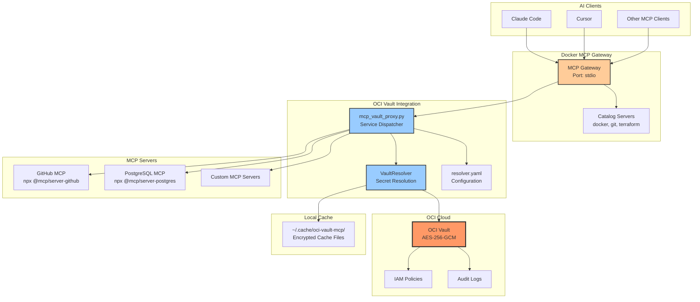

### Architecture Layers

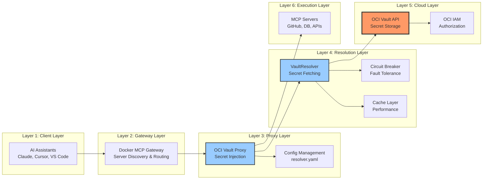

---

## Component Architecture

### VaultResolver Core Components

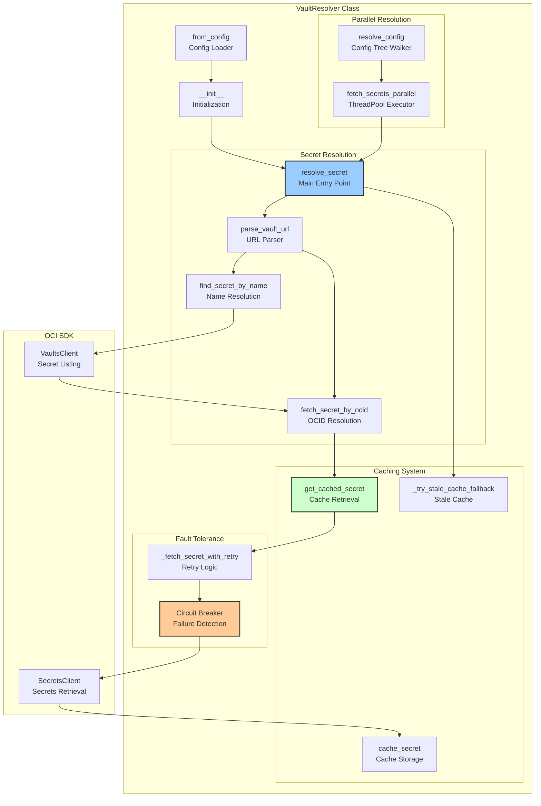

### MCP Vault Proxy Components

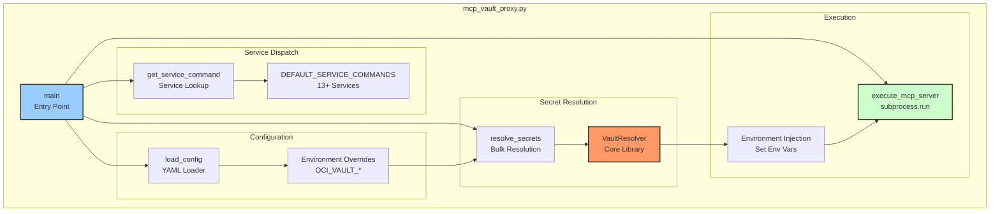

---

## Sequence Diagrams

### Secret Resolution Flow

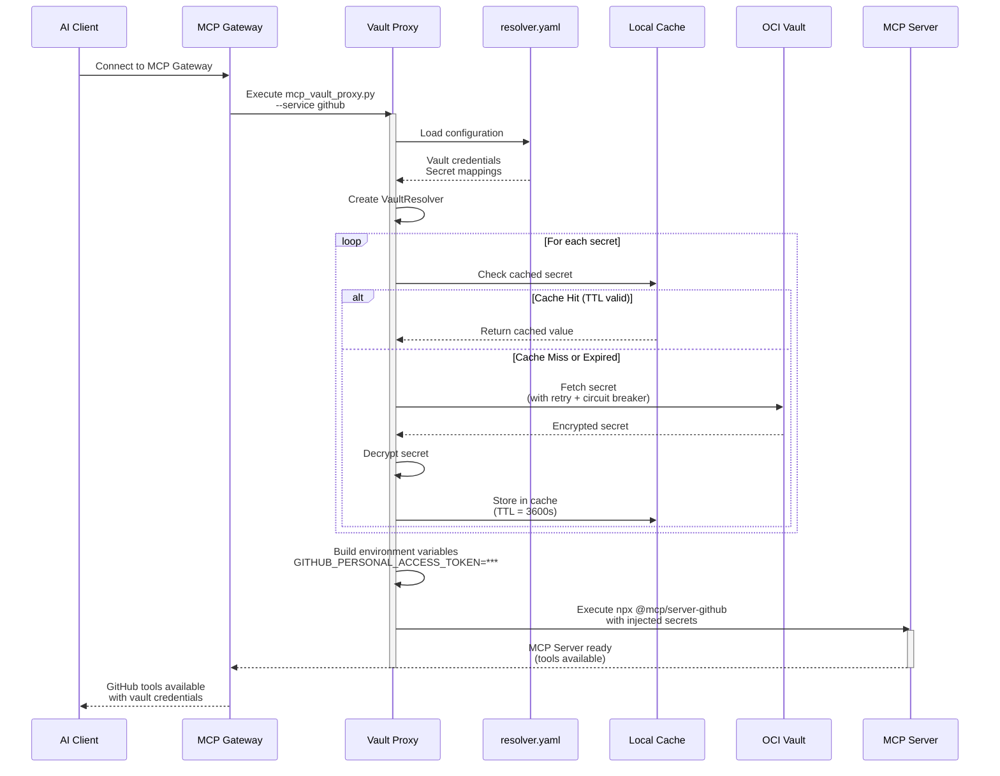

### Circuit Breaker State Transitions

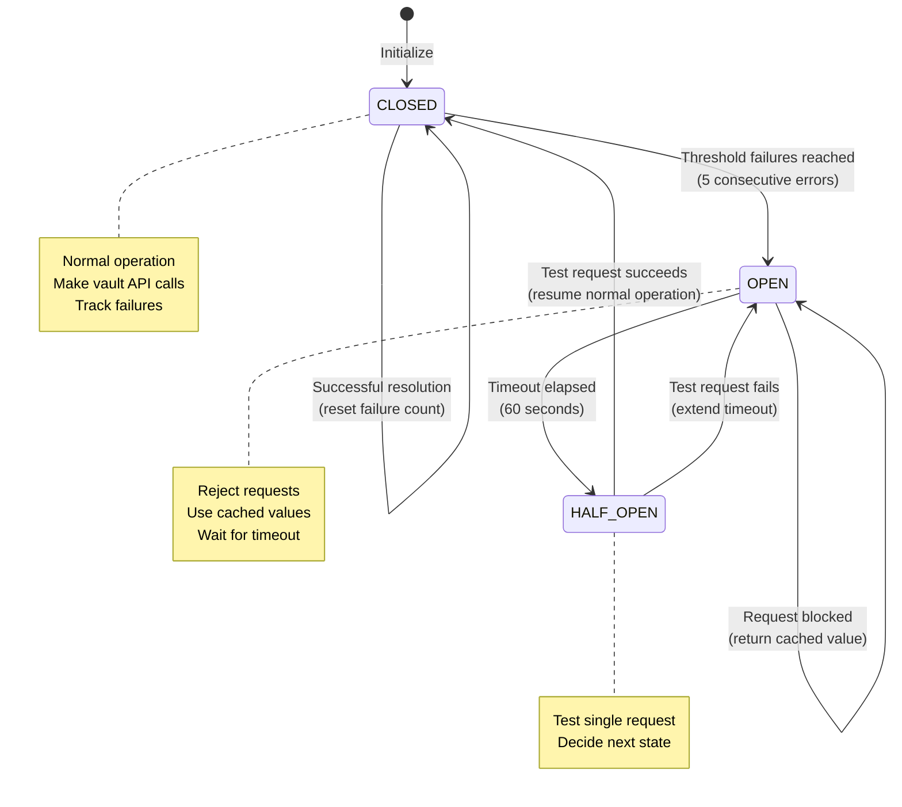

### Parallel Secret Resolution

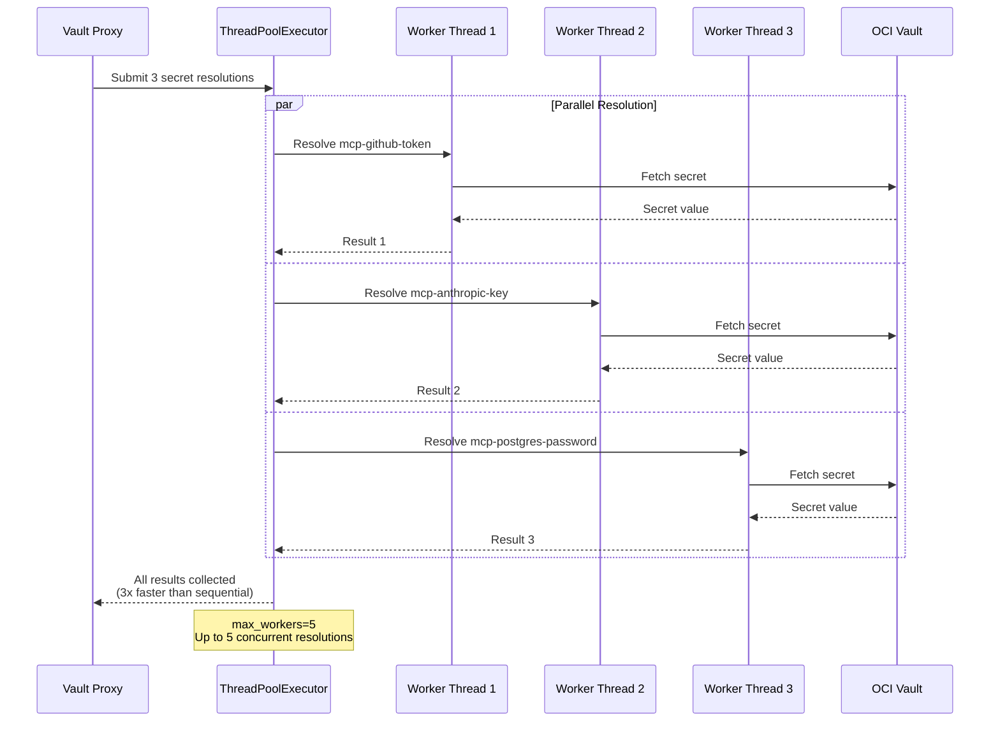

---

## Data Flow

### Configuration Loading and Merging

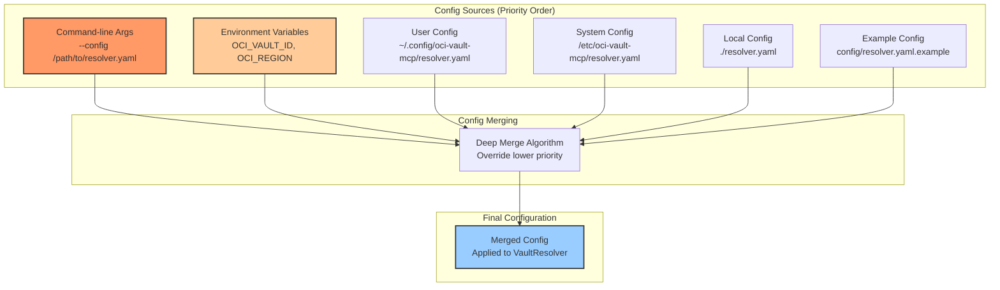

### Secret Resolution Data Flow

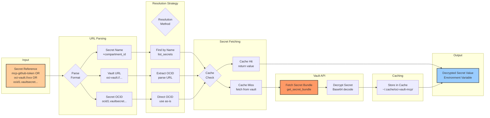

---

## Deployment Architecture

### Docker MCP Gateway Deployment

```mermaid
graph TB
    subgraph "Remote SSH Server (OCI VM)"
        subgraph "User Space"
            Gateway[Docker MCP Gateway<br/>docker mcp gateway run]
            Config[~/.docker/mcp/config.yaml<br/>Custom Server Configs]
        end

        subgraph "System Space"
            Wrapper[/usr/local/bin/<br/>mcp_vault_proxy.py]
            SysConfig[/etc/oci-vault-mcp/<br/>resolver.yaml]
        end

        subgraph "Cache"
            Cache[~/.cache/oci-vault-mcp/<br/>Encrypted Cache Files]
        end

        subgraph "OCI Config"
            OCIConfig[~/.oci/config<br/>API Keys & Profiles]
        end
    end

    subgraph "OCI Cloud (eu-frankfurt-1)"
        Vault[OCI Vault<br/>AC-vault]
        Secrets[Secrets<br/>mcp-github-token<br/>mcp-anthropic-key]
    end

    subgraph "Docker Catalog Servers"
        CatalogServers[11 Catalog Servers<br/>git, terraform, context7, etc.]
    end

    Gateway --> Config
    Gateway --> CatalogServers
    Config --> Wrapper
    Wrapper --> SysConfig
    Wrapper --> OCIConfig
    Wrapper --> Cache
    Wrapper --> Vault
    Vault --> Secrets

    style Gateway fill:#fc9,stroke:#333,stroke-width:2px
    style Wrapper fill:#9cf,stroke:#333,stroke-width:2px
    style Vault fill:#f96,stroke:#333,stroke-width:3px
```

### Multi-Environment Deployment

```mermaid
graph TB
    subgraph "Development Environment"
        DevGateway[MCP Gateway]
        DevConfig[resolver.yaml<br/>compartment: dev<br/>secrets: *-dev]
        DevVault[OCI Vault<br/>Dev Compartment]

        DevGateway --> DevConfig
        DevConfig --> DevVault
    end

    subgraph "Staging Environment"
        StageGateway[MCP Gateway]
        StageConfig[resolver.yaml<br/>compartment: staging<br/>secrets: *-staging]
        StageVault[OCI Vault<br/>Staging Compartment]

        StageGateway --> StageConfig
        StageConfig --> StageVault
    end

    subgraph "Production Environment"
        ProdGateway[MCP Gateway]
        ProdConfig[resolver.yaml<br/>compartment: production<br/>secrets: *-prod]
        ProdVault[OCI Vault<br/>Production Compartment]

        ProdGateway --> ProdConfig
        ProdConfig --> ProdVault
    end

    style DevVault fill:#cfc,stroke:#333,stroke-width:2px
    style StageVault fill:#fc9,stroke:#333,stroke-width:2px
    style ProdVault fill:#f96,stroke:#333,stroke-width:3px
```

### Kubernetes Deployment (Future)

```mermaid
graph TB
    subgraph "Kubernetes Cluster"
        subgraph "Namespace: mcp-gateway"
            Gateway[Gateway Pod<br/>docker-mcp-gateway]
            Wrapper[Sidecar: Vault Proxy<br/>mcp_vault_proxy]
        end

        subgraph "ConfigMaps"
            Config[resolver-config<br/>resolver.yaml]
            Secrets[wallet-secret<br/>OCI Wallet (base64)]
        end

        subgraph "Service"
            Service[LoadBalancer<br/>External Access]
        end
    end

    subgraph "OCI Cloud"
        Vault[OCI Vault<br/>Secrets]
        IAM[IAM Policies<br/>Workload Identity]
    end

    Service --> Gateway
    Gateway --> Wrapper
    Wrapper --> Config
    Wrapper --> Secrets
    Wrapper --> Vault
    Vault --> IAM

    style Gateway fill:#fc9,stroke:#333,stroke-width:2px
    style Wrapper fill:#9cf,stroke:#333,stroke-width:2px
    style Vault fill:#f96,stroke:#333,stroke-width:3px
```

---

## Network Architecture

### Communication Paths

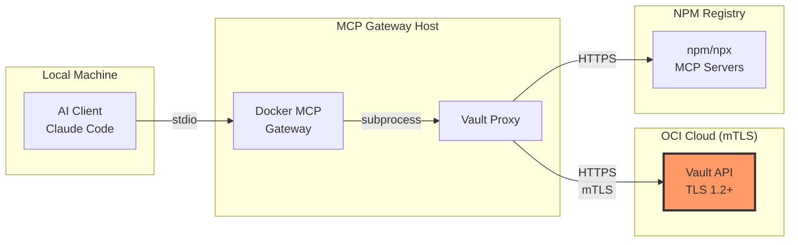

---

## Related Documentation

- [API Documentation](API_DOCUMENTATION.md) - Complete API reference
- [User Guide](USER_GUIDE.md) - Setup and usage tutorials
- [Security Architecture](SECURITY.md) - Security design and best practices
- [Deployment Guide](DEPLOYMENT.md) - Production deployment strategies
