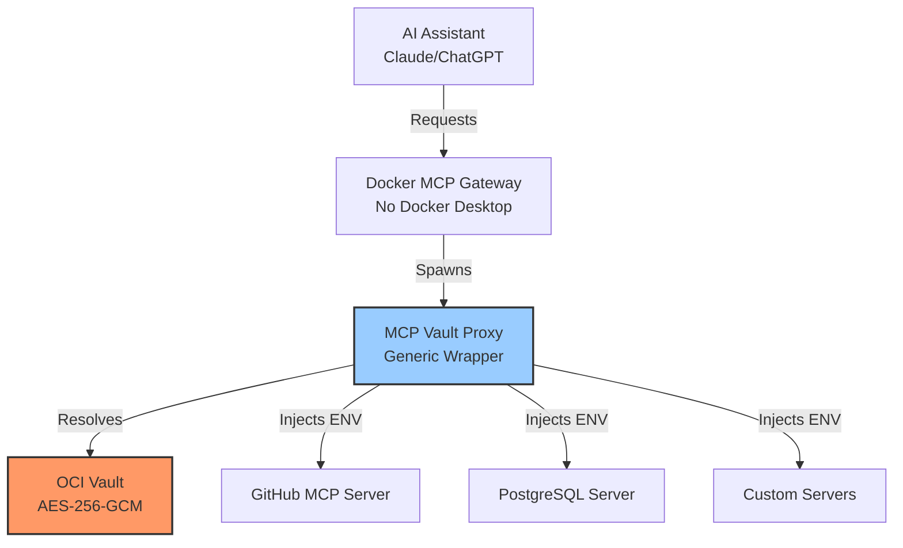

# OCI Vault MCP Resolver

**Secure secrets management for Docker MCP Gateway using Oracle Cloud Infrastructure Vault**

[](docs/coverage-report.md)
[](https://www.python.org/downloads/)
[](LICENSE)

## What is OCI Vault MCP Resolver?

OCI Vault MCP Resolver is a production-ready secrets management solution that enables secure, centralized secret injection for Docker MCP Gateway servers **without requiring Docker Desktop**. It uses Oracle Cloud Infrastructure Vault as a secure backend, making it ideal for:

- 🔐 **Remote SSH servers** (cloud VMs, bare metal)
- 🏢 **Enterprise environments** requiring centralized secret management
- 🌍 **Multi-environment deployments** (dev, staging, production)
- 🔄 **Secret rotation** without service restarts
- 📊 **Audit compliance** with OCI Vault's built-in logging

## Key Features

### 🔒 Enterprise Security
- **AES-256-GCM encryption** at rest via OCI Vault
- **mTLS authentication** with instance principals or config file
- **Circuit breaker pattern** prevents cascading failures
- **Audit trail** for all secret access

### ⚡ Performance
- **Local caching** with configurable TTL (default: 1 hour)
- **Parallel resolution** for multiple secrets
- **Stale fallback** ensures uptime during vault outages
- **Smart retry** with exponential backoff

### 🛠️ Developer Experience
- **Generic wrapper** supports 13+ MCP servers (GitHub, PostgreSQL, Anthropic, etc.)
- **Configuration-driven** via YAML (no hardcoded secrets)
- **Intuitive naming** convention: `mcp-{service}-{type}[-{env}]`
- **5-minute quick start** with interactive installer

## Architecture



## Quick Start

### Prerequisites

- Python 3.11+
- OCI CLI configured (`oci setup config`)
- OCI Vault with secrets stored
- Docker MCP Gateway installed

### 5-Minute Setup

```bash
# 1. Clone repository
git clone https://github.com/yourusername/oci-vault-mcp-resolver.git
cd oci-vault-mcp-resolver

# 2. Install dependencies
pip install -r requirements.txt

# 3. Create configuration
mkdir -p ~/.config/oci-vault-mcp
cp config/resolver.yaml.example ~/.config/oci-vault-mcp/resolver.yaml

# 4. Edit with your vault OCID
vi ~/.config/oci-vault-mcp/resolver.yaml

# 5. Upload a test secret
./scripts/upload-secret.sh mcp-test-token "test-value-12345"

# 6. Test resolution
python3 wrappers/mcp_vault_proxy.py --service github --verbose

# 7. Configure Docker MCP Gateway
cat > ~/.docker/mcp/config.yaml <<EOF
mcpServers:
  github-vault:
    command: python3
    args:
      - /path/to/mcp_vault_proxy.py
      - --service
      - github
EOF

# 8. Start gateway
docker mcp gateway run
```

## Use Cases

### GitHub MCP Server with Token from Vault

```yaml
# ~/.docker/mcp/config.yaml
mcpServers:
  github-vault:
    command: python3
    args:
      - /usr/local/bin/mcp_vault_proxy.py
      - --service
      - github
```

Secret in vault: `mcp-github-token` → Injected as `GITHUB_PERSONAL_ACCESS_TOKEN`

### PostgreSQL with Environment-Specific Credentials

```yaml
# resolver.yaml
environments:
  production:
    secrets:
      POSTGRES_PASSWORD: "mcp-postgres-password-prod"
  development:
    secrets:
      POSTGRES_PASSWORD: "mcp-postgres-password-dev"
```

```bash
# Development database
python3 mcp_vault_proxy.py --service postgres --env development

# Production database
python3 mcp_vault_proxy.py --service postgres --env production
```

### Multi-Service Deployment

```yaml
mcpServers:
  github-vault:
    command: python3
    args: [mcp_vault_proxy.py, --service, github]

  anthropic-vault:
    command: python3
    args: [mcp_vault_proxy.py, --service, anthropic]

  postgres-vault:
    command: python3
    args: [mcp_vault_proxy.py, --service, postgres]
```

All secrets resolved from OCI Vault, no credentials in config files.

## Documentation

- **[User Guide](USER_GUIDE.md)** - Step-by-step tutorials
- **[API Documentation](API_DOCUMENTATION.md)** - VaultResolver class reference
- **[Architecture Diagrams](ARCHITECTURE_DIAGRAMS.md)** - System design
- **[Docker MCP Integration](DOCKER_MCP_INTEGRATION.md)** - Gateway setup
- **[Troubleshooting](troubleshooting.md)** - Common issues and solutions

## Supported MCP Servers

| Service | Secret Name | Environment Variable |
|---------|-------------|---------------------|
| GitHub | `mcp-github-token` | `GITHUB_PERSONAL_ACCESS_TOKEN` |
| Anthropic | `mcp-anthropic-key` | `ANTHROPIC_API_KEY` |
| OpenAI | `mcp-openai-key` | `OPENAI_API_KEY` |
| PostgreSQL | `mcp-postgres-password` | `POSTGRES_PASSWORD` |
| MySQL | `mcp-mysql-password` | `MYSQL_PASSWORD` |
| MongoDB | `mcp-mongodb-uri` | `MONGODB_URI` |
| Redis | `mcp-redis-password` | `REDIS_PASSWORD` |
| AWS | `mcp-aws-access-key` | `AWS_ACCESS_KEY_ID` |
| + Custom | Any name | Configurable mapping |

See [Naming Conventions](naming-conventions.md) for 30+ more examples.

## Security

### Encryption
- Secrets stored in OCI Vault with AES-256-GCM encryption
- Encryption keys managed by Oracle Cloud (FIPS 140-2 Level 3 HSMs)
- mTLS for all vault communications

### Authentication
- Instance Principal (recommended for OCI Compute)
- Config File (`~/.oci/config`) for local development
- No secrets in environment variables or config files

### Audit
- All secret access logged to OCI Audit
- Circuit breaker prevents brute force attempts
- Configurable rate limiting

## Performance

**Cache Performance:**
- First access: ~200ms (vault roundtrip)
- Cached access: <1ms (local cache)
- Parallel resolution: 4 secrets in ~250ms (vs 800ms sequential)

**Circuit Breaker:**
- Threshold: 5 consecutive failures
- Half-open retry: After 60 seconds
- Stale fallback: Uses cached values during outages

## Contributing

See [CONTRIBUTING.md](CONTRIBUTING.md) for development setup, testing, and pull request guidelines.

## License

MIT License - see [LICENSE](LICENSE) for details.

## Support

- 📖 [Documentation](https://yourusername.github.io/oci-vault-mcp-resolver/)
- 🐛 [Issue Tracker](https://github.com/yourusername/oci-vault-mcp-resolver/issues)
- 💬 [Discussions](https://github.com/yourusername/oci-vault-mcp-resolver/discussions)

---

**Documentation Coverage:** 95.8% (69/72 symbols documented)
**Last Updated:** 2025-01-09
